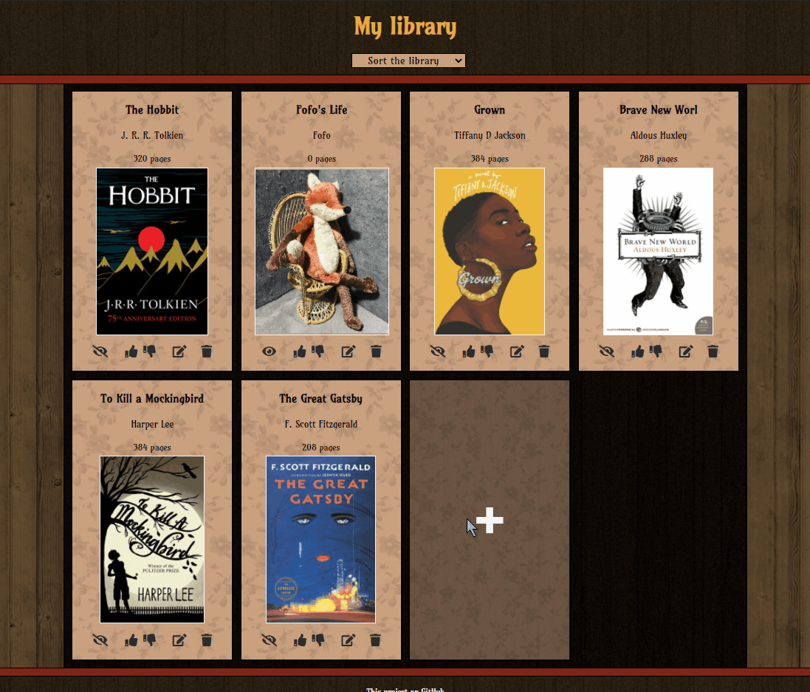
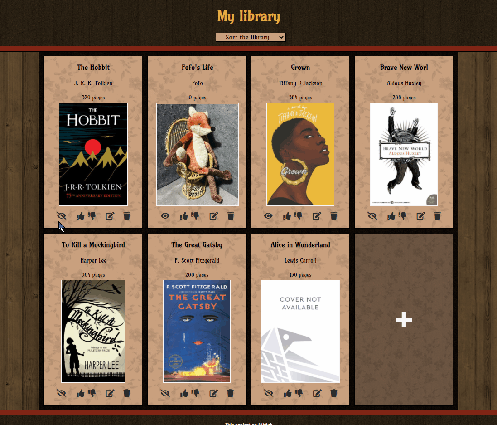
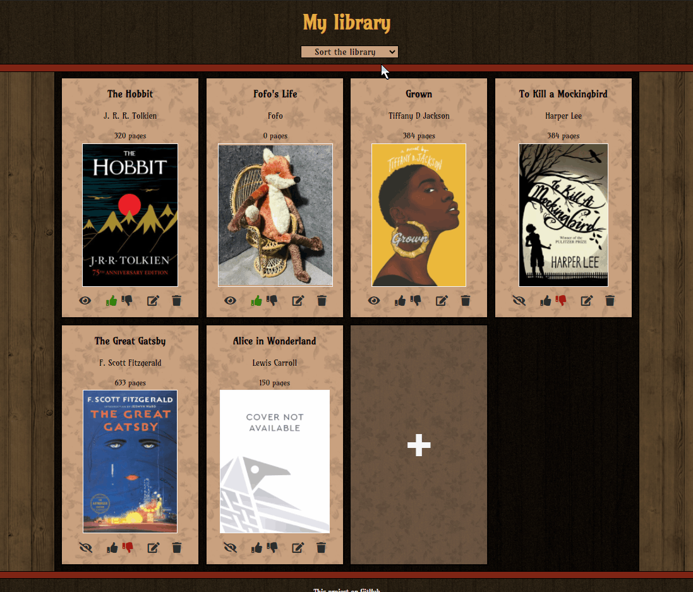

# library

<h2 align="center"><a  href="https://aurelien-genois.github.io/library/">Live Demo</a></h2>

## Description
The [fifth Odin project](https://www.theodinproject.com/paths/full-stack-javascript/courses/javascript/lessons/library) is a book library for practice JavaScript (Object constructor, Object prototype, ES6 Class ...).

## Features

- Can open a form to add a new book by clicking on the  "+" button
- Can add a new book to the library by defining the title, the author, the number of pages, an optional link for the book cover and setting optional read and like status
- Each text input of the new book form has a limit of number of characters, the number input has max and min limits for the number
- Can cancel the new book form

  
  

- Can set or unset the read status for a book by clicking on its icon
- Can like, dislike or remove the like status for a book by clicking on their icons
- Can delete a book by clicking on the bin (or trash) icon
- A confirm popup asks for a confirmation before delete the book

  
  

- Can open a edit form (similar to the new book form) by clicking on the edit icon
- Can edit a book's informations by modifying them directly in the already filled inputs 
- Can cancel the edit form

  
  

- Can sort the library alphabetically by title or author (up and down)
- Can sort by number of pages (up and down)
- Can sort by likes (likes first or dislikes first, unset likes are always in the middle of them)
- Can sort by read status (read books first or unread ones first)

## Challenges
The goal was to use the special constructor function for create objects and to add methods only on its prototype to prevent methods duplication. Later we change the constructor to a ES6 class to set the methods directly in the same bloc as the constructor function.

To keep in memory the library, localStorage is used. When objects are parsed (by JSON) from localStorage, they don't have the Book's prototype anymore (because they lose it when they are turned to string (by JSON)), so reassign the prototype on them with Object.setPrototypeOf() to Book's prototype is usefull for using Book's methods.

With this project, I used rem units with redefining global font-size and grid-template-columns to render responsive sizes and layout.

I learnt also to style html inputs with CSS pseudo-classes (hover, active, checked,... ) & pseudo-elements (after, before, placeholder).
